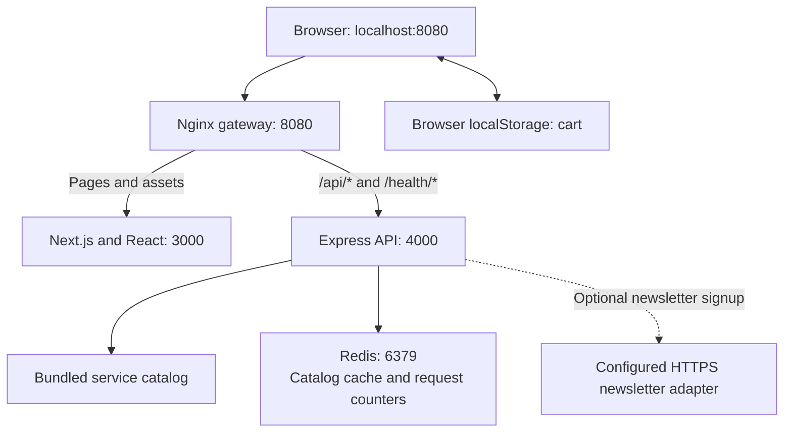

# KUMARTHAPA — Project Details

This document describes the `service-studio` project as implemented in this repository. Package versions below come from the project lockfiles and container configuration; they are not claims about the latest available releases.

## 1. Project overview

KUMARTHAPA is a digital services storefront. Visitors can browse service packages, filter them by category, add them to a cart, and review an estimate calculated by the backend.

The application includes a React frontend built with Next.js, a separate Express API, Redis for caching and request limits, and an Nginx gateway. Docker Compose starts all four services together.

| Item | Detail |
| --- | --- |
| Project directory | `service-studio` |
| Brand | KUMARTHAPA, with a separate KT mark |
| Homepage | `http://localhost:8080` |
| Checkout page | `http://localhost:8080/checkout` |
| Currency | USD; prices are stored as integer cents |
| Current checkout behavior | Generates an estimate; does not take payment or create an order |
| Application language | TypeScript, with TSX for React components |

## 2. Technology stack

### How React and Next.js work together

**React** provides the components and interactive UI: service cards, category filters, the cart drawer, and checkout updates. **Next.js** is the framework around those React components. This project uses its App Router, shared layouts, page routing, and production build system.

Both are used in the same frontend. The backend business logic lives in the separate `server/` Express application. The homepage loads its catalog in the browser through the Express API, and Redux manages the cart.

| Technology | Version or container tag | Purpose in this project |
| --- | --- | --- |
| Next.js | 16.3.4 | React application framework and App Router |
| React / React DOM | 19.2.8 | Components, hooks, and browser rendering |
| TypeScript | 5.9.3 | Type checking in the frontend and backend |
| Tailwind CSS | 3.4.19 | Styling alongside `globals.css` |
| Redux Toolkit / React Redux | 2.12.0 / 9.3.0 | Cart state and React bindings |
| Framer Motion | 12.43.0 | UI animations and reduced-motion support |
| Lucide React | 0.468.0 | Interface icons |
| Node.js | `node:22-alpine` in Docker | Runtime for the client and API containers |
| Express | 5.2.1 | HTTP API, routing, and middleware |
| Zod | 3.25.76 | Environment and request validation |
| Redis server | `redis:7.4-alpine` | Catalog cache and shared rate-limit counters |
| Redis Node.js client | 5.12.1 | Connects the API to Redis |
| Helmet / CORS | 8.3.0 / 2.8.6 | API security headers and origin configuration |
| Pino / pino-http | 9.14.0 / 10.5.0 | Structured application and request logs |
| Nginx | `nginxinc/nginx-unprivileged:1.28-alpine` | Routes browser requests to the client or API |
| Docker Compose | Compose v2 required | Builds and runs the complete application |

Sources: [client lockfile](client/package-lock.json), [server lockfile](server/package-lock.json), and [Compose configuration](docker-compose.yml).

## 3. Features and pages

| Feature | Current behavior |
| --- | --- |
| Homepage | Hero section, service catalog, approach section, shared header and footer |
| Category filters | All services, Design, Development, and Infrastructure |
| Service cards | Name, description, sample price, image, and delivery window |
| Cart | Add services, merge repeated additions, change quantities, remove items, and display subtotal |
| Cart persistence | Saves to browser `localStorage`, restores after reload, and synchronizes between tabs |
| Cart accessibility | Keyboard focus handling, Escape to close, focus restoration, and background scroll locking |
| Checkout | Requests backend prices again when cart contents change and displays a mock estimate |
| Loading and errors | Loading placeholders, empty states, and retry actions |
| Newsletter form | Requires consent and an HTTPS provider adapter; returns 503 when unavailable |
| Branding | Company logos and KT mark are included as local image assets |

The main pages are defined by [the homepage](client/src/app/page.tsx) and [checkout](client/src/app/checkout/page.tsx). [The root layout](client/src/app/layout.tsx) adds the shared providers, header, footer, and cart drawer. There are also not-found and error components.

### Included service catalog

These are sample packages defined in [catalog.ts](server/src/data/catalog.ts). Prices and delivery windows can be edited there.

| Service ID | Service | Category | Sample price (USD) |
| --- | --- | --- | ---: |
| `web-platform` | Full-stack web platform | Development | $1,499.00 |
| `brand-system` | Brand identity system | Design | $699.00 |
| `commerce` | E-commerce experience | Development | $1,999.00 |
| `product-design` | Product UI / UX design | Design | $899.00 |
| `cloud-launch` | Cloud & DevOps setup | Infrastructure | $999.00 |
| `performance` | Performance audit | Infrastructure | $299.00 |

## 4. Architecture and request flow



Only the gateway publishes a host port. The client, API, and Redis ports are internal to Docker. Open the application through port 8080 rather than the internal service ports.

1. The browser requests a page through Nginx, which forwards it to Next.js.
2. The homepage requests `/api/services`. Nginx forwards that request to Express.
3. Express applies the shared Redis rate limit, then serves the cached catalog or reads the bundled catalog data.
4. Adding a service updates Redux and browser storage.
5. Checkout sends service IDs and quantities to `/api/checkout/quote`.
6. Express looks up authoritative prices, calculates integer-cent totals, and returns the estimate.

Backend requests follow the structure **routes → controllers → services → catalog data or external adapter**. Middleware handles logging, validation errors, caching, and rate limiting.

### Where data is stored

| Data | Storage | Persistence |
| --- | --- | --- |
| Services and prices | `server/src/data/catalog.ts` | Part of the application source and built image |
| Cart | Redux and browser `localStorage` | Survives reloads on the same browser/origin when storage is available |
| Catalog cache | Redis | Temporary; expires after the configured TTL plus 0–9 seconds |
| Rate-limit counters | Redis | Temporary 60-second windows |
| Customers, orders, and payments | No implementation | No durable records are created |

Redis persistence is disabled in Compose. Restarting Redis resets its cache and counters. There is no SQL or document database configured in this project.

## 5. Project structure

```text
service-studio/
├── client/
│   ├── public/brand/           Company logos and KT mark
│   ├── src/app/                Pages, layout, global styles, errors, and icon
│   ├── src/components/         Header, footer, cart, service cards, and providers
│   ├── src/store/              Redux store, cart slice, and typed hooks
│   ├── src/lib/                API helper, UI types, and money formatting
│   ├── tests/                  Cart unit tests
│   ├── next.config.ts          Next.js standalone build configuration
│   ├── Dockerfile              Frontend container build
│   └── package.json            Frontend dependencies and npm commands
├── server/
│   ├── src/index.ts            Redis connection, HTTP startup, and shutdown
│   ├── src/app.ts              Express middleware, health routes, and API mount
│   ├── src/config.ts           Environment validation and defaults
│   ├── src/routes/             API route definitions
│   ├── src/controllers/        HTTP request and response handlers
│   ├── src/services/           Catalog, checkout, and newsletter logic
│   ├── src/data/               Sample catalog and authoritative prices
│   ├── src/middleware/         Cache, rate limiter, and error handling
│   ├── src/lib/                Redis client and logger
│   ├── tests/                  Checkout unit tests
│   ├── Dockerfile              API container build
│   └── package.json            Backend dependencies and npm commands
├── gateway/nginx.conf          Gateway routing and response headers
├── scripts/                    HTTP smoke and rate-limit checks
├── .github/workflows/ci.yml    GitHub Actions verification workflow
├── .env.example                Environment template
├── docker-compose.yml         Four-service application stack
├── PROJECT_DETAILS.md          This document
├── README.md                   Setup and deployment reference
└── VERIFICATION.md             Recorded checks and their limitations
```

## 6. Starting and managing the project

Run these commands from the `service-studio` directory. Docker Engine and Compose v2 must be installed. Commands use `sudo` for an Ubuntu account that does not have direct Docker access; omit it if your account already has access.

### First start or after changing application code

```bash
# Create .env only if it does not already exist.
test -f .env || cp .env.example .env
sudo docker compose config --quiet
sudo docker compose up --build --wait --wait-timeout 180
```

Open **http://localhost:8080**. The `--wait` command runs services in the background and waits for their startup health checks.

### Start using existing images

```bash
sudo docker compose up --wait --wait-timeout 180
```

### Status and logs

```bash
sudo docker compose ps
sudo docker compose logs --tail=100 server
sudo docker compose logs --tail=100 client
sudo docker compose logs --tail=100 gateway
sudo docker compose logs --tail=100 redis
```

Add `-f` to a logs command to follow new output. Press Ctrl+C to stop following logs.

### Stop the application

```bash
# Stop containers while keeping them available for the next start.
sudo docker compose stop

# Alternatively, stop and remove the project's containers and networks.
sudo docker compose down
```

### Rebuild a changed component

```bash
# After frontend changes:
sudo docker compose up --build --wait --wait-timeout 180 client

# After backend changes:
sudo docker compose up --build --wait --wait-timeout 180 server
```

The Compose setup uses production builds. Application source is copied into images, so editing a source file requires rebuilding its component. A plain container restart does not include source changes.

## 7. Environment configuration

The root `.env` supplies Docker Compose values. The API validates its resulting process environment using Zod in [config.ts](server/src/config.ts).

| Root `.env` variable | Example/default | Purpose |
| --- | --- | --- |
| `HOST_PORT` | `8080` | Host port published by the gateway |
| `CORS_ORIGIN` | `http://localhost:8080` | Browser origin accepted by the API's CORS configuration |
| `RATE_LIMIT_MAX` | `120` | API requests allowed per client IP in a 60-second window |
| `CACHE_TTL` | `60` | Catalog cache lifetime in seconds, before small random jitter |
| `NEWSLETTER_WEBHOOK_URL` | Empty | Optional HTTPS newsletter adapter URL |
| `NEWSLETTER_WEBHOOK_TOKEN` | Empty | Optional bearer token sent to that adapter |

Compose sets the API's `NODE_ENV=production`, `PORT=4000`, and `REDIS_URL=redis://redis:6379` directly. Those settings are not currently interpolated from the root `.env`.

For a different local port, update both `HOST_PORT` and `CORS_ORIGIN`. For example, use `HOST_PORT=8081` and `CORS_ORIGIN=http://localhost:8081`, then run:

```bash
sudo docker compose up --wait --wait-timeout 180
```

This allows Compose to recreate services affected by the changed settings. Keep credentials out of committed files; `.env` is excluded by `.gitignore`.

## 8. API reference

Requests use the gateway's base URL, `http://localhost:8080` by default.

| Method | Endpoint | Result |
| --- | --- | --- |
| GET | `/api/services` | 200 with `{ "data": [...] }`; `X-Cache` indicates `HIT` or `MISS` |
| POST | `/api/checkout/quote` | 200 with a server-calculated mock estimate in `data` |
| POST | `/api/newsletter` | 202 on adapter acceptance; 503 when unconfigured or unavailable |
| GET | `/health/live` | 200 with `{ "status": "ok" }` when the API is responding |
| GET | `/health/ready` | 200 with `{ "status": "ready" }` when Redis responds, otherwise 503 |

### Checkout request example

```bash
curl -s http://localhost:8080/api/checkout/quote \
  -H 'Content-Type: application/json' \
  -d '{"items":[{"id":"web-platform","quantity":2}]}'
```

Expected response:

```json
{
  "data": {
    "lines": [
      {
        "id": "web-platform",
        "name": "Full-stack web platform",
        "quantity": 2,
        "unitPriceCents": 149900,
        "totalCents": 299800
      }
    ],
    "currency": "USD",
    "subtotalCents": 299800,
    "totalCents": 299800,
    "mock": true,
    "notice": "Estimate only. Taxes and payment are not calculated. No order has been placed."
  }
}
```

The request accepts IDs and quantities only. Quantities must be integers from 1 to 10. Empty carts, duplicate IDs, unavailable services, client-supplied prices, and unknown fields are rejected. The schema allows up to 30 lines, subject to unique IDs from the available catalog.

### Newsletter request body

```json
{
  "email": "visitor@example.com",
  "consent": true
}
```

The API validates the address and explicit consent before forwarding to a configured HTTPS adapter. Requests to the adapter have a five-second timeout, reject redirects, and include an email-derived idempotency key. A 202 response means the adapter accepted the request; it does not confirm email delivery.

### Errors and request limits

API errors handled by Express use this shape:

```json
{
  "error": {
    "message": "Invalid request data",
    "requestId": "request-specific-id"
  }
}
```

Common statuses are 400 for invalid input, 404 for missing routes, 413 for oversized bodies, 429 for excessive requests, and 503 for unavailable dependencies. Nginx can reject requests before they reach Express; those gateway responses may use a different format.

The default rate limit is shared across `/api/*` routes and API replicas: 120 requests per IP per 60 seconds. A 429 response includes `Retry-After`. Health endpoints are outside this limiter. If the Redis rate limiter fails, API requests return 503; catalog-cache fallback does not bypass that requirement.

## 9. Development and verification

Docker supplies Node.js, Redis, and Nginx for the complete stack. Host Node.js 22+ is needed only when running the supplied npm commands or HTTP test scripts outside containers.

Run unit tests and builds from the project root:

```bash
npm --prefix server ci
npm --prefix server test
npm --prefix server run build

npm --prefix client ci
npm --prefix client test
npm --prefix client run build
```

Both packages also provide `dev`, `start`, and `typecheck` scripts. `server` development uses `tsx watch`; `client` development uses `next dev`. For development, Next.js forwards `/api/*` and `/health/*` to `http://127.0.0.1:4000`; production routing remains in Nginx. A complete host development stack needs a running local Redis server and both npm development processes. The root `.env` is not automatically loaded by the server's npm scripts. See [RUN_COMMANDS.md](RUN_COMMANDS.md) for both Docker and local development commands.

With the Docker stack running, verify its API and Redis behavior:

```bash
node scripts/smoke.mjs
node scripts/rate-limit.mjs
```

The smoke script checks readiness, catalog caching, checkout totals, invalid quantities, price tampering, and missing routes. Run the rate-limit script last: it deliberately exhausts the default request allowance, so wait for the returned retry interval before normal use. Set `BASE_URL` when using another port, for example `BASE_URL=http://localhost:8081 node scripts/smoke.mjs`.

The repository contains 3 backend unit tests and 2 frontend unit tests. Both suites and both production builds passed during the local setup check; see [VERIFICATION.md](VERIFICATION.md) for the recorded environment and scope. [GitHub Actions](.github/workflows/ci.yml) is configured to run tests, builds, dependency audits, container startup, and HTTP checks. Its configuration alone does not establish that a CI run passed.

## 10. Where to make common changes

| Change | Main file or directory |
| --- | --- |
| Homepage copy and sections | [client/src/app/page.tsx](client/src/app/page.tsx) |
| Shared page title and metadata | [client/src/app/layout.tsx](client/src/app/layout.tsx) |
| Global styling and responsive rules | [client/src/app/globals.css](client/src/app/globals.css) |
| Header and navigation | [client/src/components/Header.tsx](client/src/components/Header.tsx) |
| Footer, newsletter form, and contact links | [client/src/components/Footer.tsx](client/src/components/Footer.tsx) |
| Logo files and presentation | [client/public/brand](client/public/brand) and [BrandLogo.tsx](client/src/components/BrandLogo.tsx) |
| Browser icon | [client/src/app/icon.png](client/src/app/icon.png) |
| Services, prices, images, and delivery text | [server/src/data/catalog.ts](server/src/data/catalog.ts) |
| Service-card design | [client/src/components/ServiceCard.tsx](client/src/components/ServiceCard.tsx) |
| Cart display and behavior | [CartDrawer.tsx](client/src/components/CartDrawer.tsx) and [cartSlice.ts](client/src/store/cartSlice.ts) |
| Cart persistence and tab synchronization | [client/src/components/Providers.tsx](client/src/components/Providers.tsx) |
| Checkout page | [client/src/app/checkout/page.tsx](client/src/app/checkout/page.tsx) |
| Checkout validation and authoritative totals | [server/src/services/checkoutService.ts](server/src/services/checkoutService.ts) |
| API endpoints | [server/src/routes/index.ts](server/src/routes/index.ts) |
| Newsletter integration | [server/src/services/newsletterService.ts](server/src/services/newsletterService.ts) |
| Gateway routing | [gateway/nginx.conf](gateway/nginx.conf) |
| Container ports, resources, and services | [docker-compose.yml](docker-compose.yml) |

After changing catalog data, rebuild the server. Previously cached catalog responses can remain visible until their TTL expires; bump the `studio:catalog:v1` key in the routes file when a catalog schema change requires immediate invalidation. Existing browser carts may retain older display data, while checkout recalculates from the current backend catalog.

## 11. Troubleshooting

| Symptom | Check or action |
| --- | --- |
| `docker: command not found` | Follow the Ubuntu installation steps in [README.md](README.md) |
| Docker socket permission denied | Use the documented `sudo docker compose ...` commands |
| Port 8080 is already in use | Change both `HOST_PORT` and `CORS_ORIGIN`, then recreate the stack |
| Startup health check fails | Inspect `sudo docker compose ps` and logs for the affected service |
| Catalog or readiness returns 503 | Check `server` and `redis` logs; Redis is required by the rate limiter |
| API returns 429 after testing | Wait for the `Retry-After` interval; the rate-limit test intentionally triggers this |
| Code edits do not appear | Rebuild the affected image with `docker compose up --build` |
| Newsletter signup returns 503 | Configure a working HTTPS adapter and recreate the server |
| Package download times out through an npm mirror | For host installs, retry with `npm --prefix client ci --registry=https://registry.npmjs.org` |
| Service photos do not load | The demo photos use external Unsplash URLs; check connectivity or replace the assets |

## 12. Current scope and future work

The project implements service browsing, browser cart storage, and backend-priced estimates. Payment processing, tax calculation, durable orders, customer accounts, authentication, and an admin dashboard are not implemented. Newsletter delivery depends on a separately configured provider adapter.

For a commercial launch, the next work includes durable business storage, authentication, payment and webhook integration, configured newsletter handling, approved content and imagery, HTTPS, monitoring, backups, and deployment testing. The current Compose file runs on one host; availability and traffic capacity have not been established by load tests.

For the detailed deployment considerations, use [README.md](README.md). For the history of completed checks, use [VERIFICATION.md](VERIFICATION.md).
