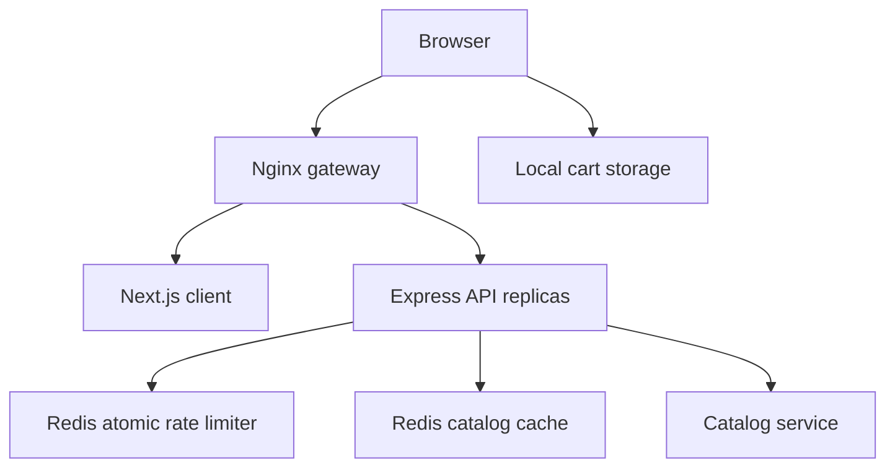

# KUMARTHAPA

A professional portfolio and service storefront using the existing Next.js App Router, TypeScript, Tailwind CSS, Redux Toolkit, Framer Motion, Lucide, Express, and Redis foundation. Includes six industrial project concepts, six distinct interactive showcase websites, locally generated visuals, and White / Blue / Black themes with White as the default. The original catalog, accessible persistent cart, and server-priced mock checkout remain available at `/services` and `/checkout`.

For the portfolio routes, demo scope, image replacement workflow, editable content, and image prompts, see [Portfolio Content](PORTFOLIO_CONTENT.md).

See [Verification](VERIFICATION.md) for completed browser, build, and API checks and the external setup still needed for deployment and message delivery.

For a consolidated explanation of the technology stack, architecture, features, API, development workflow, and files to edit, see [Project Details](PROJECT_DETAILS.md).

For copy-and-paste commands to run with Docker or directly with Node.js and Redis, see [Run Commands](RUN_COMMANDS.md).

**Scope:** a deployable application foundation with demo catalog and checkout. It does not process payments, create orders, authenticate customers, or send newsletters without a configured provider. No real sales or customer records are persisted. See production requirements below before taking payments.

## Run with Docker

Prerequisites: Docker Engine/Desktop with Compose v2. Node.js is only needed outside Docker for the optional tests. Allocate at least 4 GB RAM for the build. Run these commands from the extracted `service-studio` directory.

On Ubuntu 24.04, if `docker` is not installed, install the Ubuntu packages first:

```bash
sudo apt update
sudo apt install -y docker.io docker-compose-v2 docker-buildx
sudo systemctl enable --now docker
sudo docker compose version
```

These commands require your Ubuntu password. If you already use Docker's own apt repository, follow its [Ubuntu installation instructions](https://docs.docker.com/engine/install/ubuntu/) instead of mixing the two package sources.

For a fresh Ubuntu installation, start the project with `sudo`:

```bash
# Preserve any existing environment settings.
test -f .env || cp .env.example .env
sudo docker compose config --quiet
sudo docker compose up --build --wait --wait-timeout 180
sudo docker compose ps
```

Use `sudo` for the remaining Docker commands as well if your account does not have Docker access. No separate host installation of Node.js, Redis, or Nginx is required for this setup.

If Docker is already installed and accessible to your account:

```bash
test -f .env || cp .env.example .env
docker compose config
docker compose up --build --wait --wait-timeout 180
```

Open **http://localhost:8080**. Checkout is **http://localhost:8080/checkout**, and the Let’s talk page is **http://localhost:8080/contact**. The gateway is the only published port; client, API, and Redis are private within Docker networks.

```bash
# Inspect status and logs
docker compose ps
docker compose logs -f server

# Check readiness and cache behavior
curl -i http://localhost:8080/health/ready
curl -i http://localhost:8080/api/services
curl -i http://localhost:8080/api/services

# Get a trusted quote (integer cents, USD)
curl -s http://localhost:8080/api/checkout/quote \
  -H 'Content-Type: application/json' \
  -d '{"items":[{"id":"web-platform","quantity":2}]}'

# Stop the application
docker compose down
```

A repeated catalog request returns `X-Cache: HIT`. Writes are asynchronous, so the immediate next request may still be a miss. The two-package quote totals 299800 cents ($2,998.00). Health endpoints are not rate limited.

If port 8080 is busy, change both `HOST_PORT` and `CORS_ORIGIN` in `.env`, then recreate with `docker compose up -d`. Production origin must match the browser origin exactly. Never commit `.env` files containing credentials.

## Test

With Node.js 22+ and the stack running:

```bash
node scripts/smoke.mjs
node scripts/rate-limit.mjs
```

The smoke test checks readiness, catalog cache hits, server-side totals, quantity validation, price tampering, and 404 behavior. Run the rate-limit test last; it intentionally consumes the default 120-request window. Wait up to 60 seconds before interacting again. Set `BASE_URL` for a non-default host/port.

Run unit tests and production builds outside Docker:

```bash
cd server
npm ci
npm test
npm run build
cd ../client
npm ci
npm test
npm run build
cd ..
```

Or run unit tests with Docker alone (source mounted read-only, dependencies in named volumes):

```bash
docker run --rm -v "$PWD/server:/app:ro" -v kumarthapa-server-deps:/app/node_modules -w /app node:22-alpine sh -c 'npm ci && npm test'
docker run --rm -v "$PWD/client:/app:ro" -v kumarthapa-client-deps:/app/node_modules -w /app node:22-alpine sh -c 'npm ci && npm test'
```

CI runs unit tests, production builds, dependency audits, both Docker builds, and HTTP smoke/rate-limit tests. The CI file is supplied, not a claim that GitHub Actions has already run.

Manual UI acceptance:

1. Open the catalog at desktop and mobile widths. Filter each category.
2. Add a service twice; confirm the badge and subtotal update.
3. Change quantity, remove a line, close/reopen, and reload to check persistence.
4. Open another tab; changes should synchronize through the storage event.
5. Open the drawer with a keyboard; Tab stays inside, Escape closes, and focus returns.
6. Open checkout and edit the cart; the quote refreshes from the API. An empty cart has a clear recovery action.
7. Stop the API, reload the catalog, then restart it and use Try again.
8. Submit the newsletter with consent. Without a configured provider it displays an explicit unavailable message; with a provider it confirms only upstream acceptance.

## Architecture



**Request boundary:** Nginx forwards `/api/*` to Express and other requests to Next.js. Browser requests stay same-origin. No public API base URL is baked into the client build. API health is available at `/health/live` and `/health/ready`.

**Server:** routes → controllers → services → catalog data. Middleware handles security, structured request logging, request IDs, request-size limits, error responses, and rate limiting. Checkout receives IDs and quantities only; client-provided prices and unknown fields are rejected. Totals use integer cents. Duplicate IDs, unavailable items, quantities outside 1–10, and an empty cart are rejected.

**Caching:** the public service catalog uses a versioned Redis key with a 60-second TTL plus 0–9 seconds of jitter. Increment the key version after schema/catalog changes, or delete `studio:catalog:v1` to invalidate immediately. Cache read/write failures are logged and fall back to catalog source. The source is a bundled sample, so no database stampede is possible here; add distributed single-flight refresh or stale-while-revalidate before replacing it with expensive database queries.

**Rate limiting:** an atomic Lua script increments an IP counter and sets expiry in one operation. Shared Redis makes it consistent across API replicas. Fixed-window limit: 120 requests / 60 seconds by default; boundary bursts are possible. Returns 429 with `Retry-After` and rate headers. Redis/limiter failure returns 503 (fail closed), even if catalog fallback could otherwise serve the request. This deliberately prioritizes abuse protection over availability. Redis commands have bounded application wait times and offline queuing is disabled.

**Proxy trust:** Express trusts one proxy hop. Only Nginx publishes a host port, and it overwrites incoming `X-Forwarded-For`. Do not expose the API directly with this configuration. If adding a load balancer/CDN, configure Nginx real-IP handling for exact trusted CIDRs; otherwise all visitors may share the load balancer IP. Never trust arbitrary forwarded headers.

**State:** one Redux store per provider instance avoids shared server state. Hydration occurs after mount; persistence is not written until restored. Invalid JSON and malformed entries are discarded; quantities are capped. Tabs synchronize. localStorage is untrusted and used only for display; the quote is authoritative. The cart panel handles focus trapping, Escape, background inertness, scroll locking, and focus restoration. Motion respects reduced-motion preferences.

**Containers:** multi-stage builds, lockfile-based `npm ci`, non-root application users, graceful API shutdown, init process, health checks, memory budgets, private Redis network, and no published database ports. Redis has a bounded 128 MB budget and `noeviction` so cache pressure cannot silently evict rate-limit counters. OOM produces 503 until keys expire. This demo intentionally uses ephemeral Redis; restarts reset cache and counters. It is never an order database.

## Repository map

See `TREE.txt` for the complete file list.

```text
service-studio/
├── client/
│   ├── src/app/                 # Home, checkout, errors, layout, Tailwind/CSS
│   ├── src/components/          # Header, Footer, ServiceCard, CartDrawer, Providers
│   ├── src/store/               # Redux store, cart slice, typed hooks
│   ├── src/lib/                 # API client, shared frontend types, money formatting
│   ├── tests/                   # Cart behavior and storage corruption checks
│   ├── Dockerfile
│   └── package-lock.json
├── server/
│   ├── src/controllers/
│   ├── src/services/
│   ├── src/routes/
│   ├── src/middleware/          # Cache, rate limit, error handling
│   ├── src/lib/                 # Redis connection and logger
│   ├── src/data/                # Authoritative sample catalog
│   ├── tests/                   # Quote totals and untrusted input tests
│   ├── Dockerfile
│   └── package-lock.json
├── gateway/nginx.conf
├── scripts/                    # HTTP smoke and rate-limit tests
├── .github/workflows/ci.yml
├── .env.example
├── docker-compose.yml
├── TREE.txt
├── VERIFICATION.md
└── README.md
```

## API contract

| Method | Path                  | Behavior                                             |
| ------ | --------------------- | ---------------------------------------------------- |
| GET    | `/api/services`       | `{ data: Service[] }`, `X-Cache` HIT/MISS            |
| POST   | `/api/checkout/quote` | `{ items: [{ id, quantity }] }` → trusted mock quote |
| POST   | `/api/newsletter`     | 202 with provider acceptance; 503 when unconfigured  |
| POST   | `/api/contact`        | Validated project inquiry; 202 with adapter acceptance, 503 when unconfigured |
| GET    | `/health/live`        | Process liveness                                     |
| GET    | `/health/ready`       | Redis availability; 200 or 503                       |

Errors use `{ error: { message, requestId? } }`. No internal stack traces are sent to users. Prices are sample USD package prices. Delivery windows and photos are placeholders, not business commitments. Service and portfolio images are local concept assets. Replace them using the content guide when real brand photography and screenshots are available.

## Production deployment and scaling

This Compose file is a single-host deployment, not high availability or proof of heavy-traffic capacity. There are no benchmarked RPS or latency promises.

- Terminate HTTPS at your ingress/load balancer, enable HSTS after HTTPS is established, and configure the exact public origin. Replace the inline-script CSP with per-request nonces if your threat model requires it.
- Run stateless client/API replicas behind a health-aware load balancer. The Nginx Docker DNS resolver refreshes service addresses; basic local scaling can be exercised with `docker compose up -d --scale server=3`. Compose is not an autoscaler and a single gateway remains a failure point.
- Use managed Redis with TLS/ACLs, suitable failover, monitoring, and a separate rate-limit store if eviction and durability requirements differ. Test limiter behavior through failover; Redis replication does not guarantee perfectly preserved counters.
- Add PostgreSQL or another durable transactional store for customers, catalog, orders, and audit records. Add authenticated checkout, provider-created payment sessions, server-side pricing, idempotency keys, and signed webhook verification before accepting payments.
- Integrate a newsletter provider with consent records, unsubscribe support, validation, and an appropriate retention policy. Replace all demo contact and social links.
- Add edge/WAF request limits, bot controls, metrics, traces, alerting, backups/restore drills, image optimization/CDN, load tests, and agreed latency/error budgets. Coordinate Next.js cache/build IDs if adding dynamic server caching across instances.
- Pin container base-image digests for releases, refresh patched dependencies, generate an SBOM, scan images, and run CI gates. Use a secret manager for production credentials.

## Reference documentation

- [Next.js self-hosting](https://nextjs.org/docs/app/guides/self-hosting)
- [Docker Next.js container guide](https://docs.docker.com/guides/nextjs/)
- [Redis distributed rate limiting](https://redis.io/docs/latest/develop/use-cases/rate-limiter/nodejs/)

## Enable newsletter signup

Set `NEWSLETTER_WEBHOOK_URL` to an HTTPS endpoint you control and optionally `NEWSLETTER_WEBHOOK_TOKEN`, then recreate the server. The adapter receives `{ email, consent: true, consentedAt, source }`, a bearer token if configured, and a SHA-256 email idempotency key. It must return 2xx only after durably accepting the request, handle duplicate requests, and implement confirmation/unsubscribe with your email platform. The application validates email and consent, applies the shared rate limit, rejects redirects, and bounds upstream calls to five seconds. With no endpoint configured, it returns 503 and does not store an email or claim success. No external newsletter endpoint was contacted during this build.

## Enable contact inquiries

The `/contact` route renders `client/src/app/contact/letstalk.tsx`. Desktop, mobile, and footer navigation link to this page. The form supports service selections, optional budget and timing, browser validation, loading, retry, and confirmation states. Failed submissions preserve the entered details.

Set `CONTACT_WEBHOOK_URL` to an HTTPS adapter you control and optionally set `CONTACT_WEBHOOK_TOKEN`, then recreate the server. For local Node.js development, export these variables in the server environment before starting it. The adapter receives `{ name, email, company, services, budget, timeline, message, consent: true, submittedAt, source: "kumarthapa-contact" }`, with a bearer token when configured. It should deliver to your inbox or CRM, return 2xx only after durably accepting the inquiry, and deduplicate retries using the SHA-256 `Idempotency-Key` header. The application uses the existing API rate and request-size limits, validates all fields server-side, rejects redirects, and bounds adapter calls to five seconds. Without an adapter, the API returns 503; no message is stored or marked as sent. The form’s budget ranges use USD, matching the catalog.

## Brand assets

The supplied **KUMARTHAPA** company logos and the separate **KT** brand mark are included in `client/public/brand/`. Originals are copied unchanged. The original light company wordmark appears with the default White theme; the original dark version appears with Blue and Black themes. Checkout retains its light wordmark. KT is used for compact mobile branding and the app icon. `BrandLogo.tsx` and the final branding rules in `globals.css` frame the originals' whitespace without modifying their files. Replace the app icon with an approved, tightly framed export if you want a larger mark in browser tabs.
